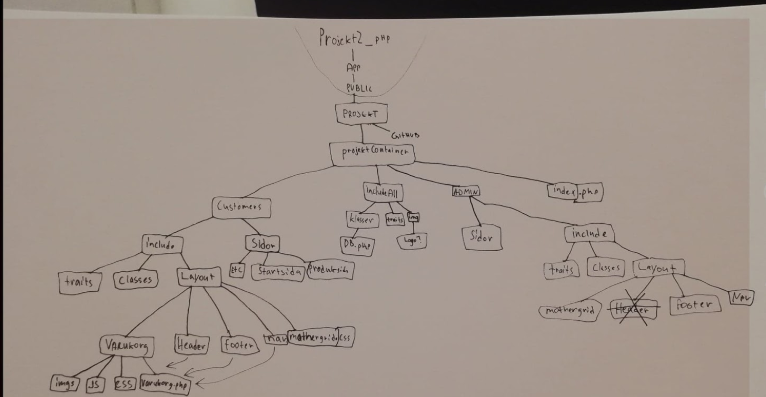
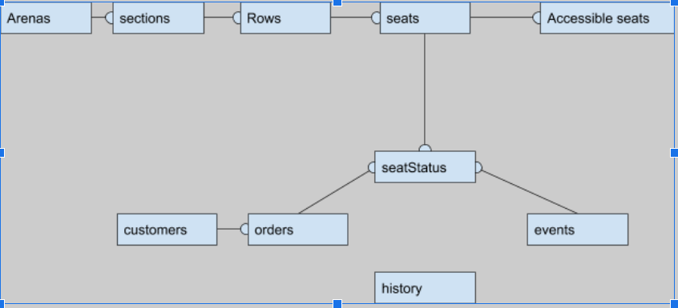

<h1>Tickets</h1>
<a href="http://tickets.loboessence.se/index.php"><b>Länk till sidan </b></a>

 Skolprojekt som pågick i 3v med kraven:
    <ul>
        <li> En admin ska kunna skapa biljetter.</li>
        <li> En kund ska kunna lägga till biljetterna i sin varukorg. </li>
        <li> En Anställd ska kunna lägga in biljettens id och då kunna verifiera att biljetten är köpt och ej tidigare skannad. </li>
    </ul>

    Nu kan:
    <ul> 
        <li>Admin skapa arena, sektioner, rader och platser i arenan. </li>
        <li>En kund kan lägga in biljetter i sin varukorg.</li>
        <li>En kund kan 'köpa' biljetterna. Då blir biljetten ej tillgänglig för köp för andra, samtidigt som kunden kan hitta den på sin kontosida.  </li>
        <li>En anställd kan skriva in kundens biljettID och få reda på huruvida biljetten är köpt, och om den redan har skannats. </li>
    </ul>

<h2>Verktyg</h2>
<ul>
    <li> Github </li>
    <li> Filezilla </li>
    <li> PhPmyAdmin </li>
    <li> Binero </li>
    <li> Trello </li>
</ul>

<h2>Mappstruktur</h2>

<h2> Github </h2>
<ul>
    <li>master
        <ul> 
            <li> hotfixes </li>
            <li> develop 
            <ul>
                <li>feature</li>
            </ul>
            </li>
        </ul>
    </li>
</ul>

<h2> Server </h2>
<ul> 
    <li>Subdomän på binero </li>
    <li>Skickar till binero via filezilla </li>
    <li>DB i phpMyadmin</li>
</ul>

<h2>User Stories </h2>
<h3> Jag som användare vill kunna... </h3>
<h4> Events </h4>
<ul>
    <li>Söka efter event</li>
    <li>Se kommande event </li>
    <li>Se events av typen sport </li>
    <li>Se events av typen konsert </li>
    <li>Kunna välja att se events av kategorin:
        <ul>
            <li>Sport</li>
            <li>Konsert</li>
            <li>Etc</li>
        </ul>
     </li>
    <li>Kunna välja att se events av subkategorin:
        <ul>
            <li>Fotboll</li>
            <li>Ishockey</li>
        </ul>
    </li>
    <li>Kunna välja att se events av subkategorin:
        <ul>
            <li>Fotboll, män</li>
            <li>Fotboll, kvinnor</li>
            <li>Ishockey, män</li>
            <li>Ishockey, kvinnor</li>
        </ul>
    </li>
    <li>Kunna välja:
        <ul>
            <li>sektion</li>
            <li>rad</li>
            <li>plats</li>
        </ul>
    </li>
</ul>

<h4> Konto </h2>
<ul>
    <li>Se mina uppgifter</li>
    <li>Ändra mina uppgifter</li>
    <li>Ta bort mitt konto</li>
    <li>Skapa konto </li>
    <li>Logga in </li>
    <li>Logga ut </li>
    <li>Se mina ordrar</li>
    <li>Se detaljer på mina ordrar</li>
    <li>Se vilka event jag har köpt biljetter till</li>
    <li>Kunna välja att filtrera så jag endast ser event jag har köpt biljetter till som ännu varit.</li>
    <li>Få ett mail med ordernr, pris och annan relevant information. </li>
    <li></li>
</ul>

<h4>Varukorg</h4>
<ul>
    <li>Lägga till biljetter i varukorg</li>
    <li>Se totalpriset av min varukorg</li>
    <li>Kunna gå till kassa</li>
    <li>Se innehållet av min varukorg</li>
    <li>Se hur lång tid det är innan min varukorg timear ut.</li>
</ul>

<h3>Jag som Admin vill kunna...</h3>
<ul>
    <li>Logga in / logga ut</li>
    <li>Skapa:
        <ul>
            <li>Kunder</li>
            <li>Anställda</li>
            <li>Admins</li>
            <li>Events</li>
            <li>Arenor</li>
            <li>Sections</li>
            <li>Rows</li>
            <li>Seats</li>
        </ul>
    </li>
    <li>Se:
        <ul>
            <li>Kunder </li>
            <li>Anställda </li>
            <li>Admins </li>
            <li>Events </li>
            <li>Arenor </li>
        </ul>
    </li>
    <li> Uppdatera
          <ul>
            <li>Kunder </li>
            <li>Anställda </li>
            <li>Admins </li>
            <li>Events </li>
            <li>Arenor </li>
        </ul>
    </li>
    
</ul>

<h3>Jag som Employee vill kunna...</h3>
<ul>
    <li> Uppdatera
          <ul>
            <li>'Skanna' biljetter för att se om:
                <ul>
                    <li>Biljetten redan är köpt</li>
                    <li>Biljetten finns.</li>
                    <li>Biljetten redan är skannad.</li>
                    <li>Vem som har köpt den</li>
                </ul>
            </li>
            <li>Anställda </li>
            <li>Admins </li>
            <li>Events </li>
            <li>Arenor </li>
        </ul>
    </li>
</ul>

<h3>Extra</h3>
<ul>
    <li>Skapa visualisering av arenan via färglagda divs. Gröna = kan köpas, gråa = kan inte köpas</li>
    <li>Skapa antalet platser beroende på öppna sections, rows etc. </li>
</ul>

<h2>UML</h2>

<h3> DoD </h3>
<ul>
    <li>Kod testat och klarar testmiljö. </li>
    <li>Kod testad och klarar live server</li>
    <li>Merge till master</li>
    <li>Upplagt på tillgänglig server</li>
    <li>DB upplagd på tillgänglig server</li>
    <li>Dokumentation klar </li>
</ul>

